# Web Scraper

This is a highly customizable, Puppeteer-based scraper with experimental AI features.\
The initial idea was to develop an advanced testing tool for web projects.

## Table of Contents

- [Web Scraper](#web-scraper)
  - [Table of Contents](#table-of-contents)
  - [Examples](#examples)
    - [Example recording of a scraper execution](#example-recording-of-a-scraper-execution)
    - [Example recording of a scraper creation process](#example-recording-of-a-scraper-creation-process)
  - [Requirements](#requirements)
  - [System support](#system-support)
  - [Features and use cases](#features-and-use-cases)
    - [Regular web scraping](#regular-web-scraping)
    - [Routines](#routines)
    - [CLI](#cli)
    - [AI](#ai)
    - [Portal](#portal)
  - [Getting started](#getting-started)
    - [Web interface](#web-interface)
    - [Preferences](#preferences)
      - [Mind the resolution](#mind-the-resolution)
    - [Info](#info)
    - [Creating new scrapers](#creating-new-scrapers)
      - [Basic information](#basic-information)
      - [Preparing Data Stores](#preparing-data-stores)
      - [Attach Data Stores to the scraper](#attach-data-stores-to-the-scraper)
      - [Setup instructions](#setup-instructions)
      - [Special strings](#special-strings)
      - [Using custom JavaScript code](#using-custom-javascript-code)
      - [Data related instructions](#data-related-instructions)
    - [Executing scrapers](#executing-scrapers)
      - [Configuring iterator](#configuring-iterator)
      - [Single execution](#single-execution)
      - [Routine execution](#routine-execution)
      - [CLI execution](#cli-execution)
  - [Development setup](#development-setup)
  - [Future plans](#future-plans)
  
## Examples

### Example recording of a scraper execution

<video width="640" height="256" controls>
  <source src="recordings/scraper-execution.mp4" type="video/mp4">
</video>

### Example recording of a scraper creation process

Coming soon!

## Requirements

- Chrome or Chromium browser is required.\
It might be necessary to provide path to the browser executable in the settings.
- Ollama is required for AI features. [About Ollama](https://ollama.ai/)\
User must also make sure that proper model is pulled and ready to use in Ollama.\
By default, the project uses [qwen2.5vl:32b](https://ollama.com/library/qwen2.5vl) model. It can be changed via Web Scraper preferences.
- Optionally some SQL and HTML/JavaScript knowledge will be helpful to fully utilize the project potential.

## System support

- Development:\
The development mode should work on every system without any additional setup except `npm install` of course.

- SEA:\
There is a SEA build possible. [About SEA](https://nodejs.org/api/single-executable-applications.html)\
For now, the SEA has only been build and tested on Linux.\
I'm happy to provide support and binaries for other systems upon request.\
To build the SEA, run `npm run build:sea` in the root directory.

## Features and use cases

### Regular web scraping

Properly configuring a working scraper can be difficult at first.
This project is designed to be highly customizable and flexible.\
This is a fairly obvious statement, but a scraper can interact with websites in various ways, such as typing, clicking, and scrolling.

Users can define conditions that allow the scraper to decide its course of action based on data from the page or external sources.\
In addition to conditions, the scraper can also return to previous instructions, forming a controlled loop in the scraper execution.\
Another form of repetition is possible: the scraper can iterate over a set of data. For example, it can iterate over every nth row of a table.

See [Getting started](#getting-started) section for more details and examples.

### Routines

By configuring routines, users can schedule scraper executions at specific times or intervals.\
For example, you can set up a routine that runs a scraper at noon every day. For the sake of this example, let's say the scraper updates cryptocurrency prices stored in a database. Since the database is just a local SQLite file, users can do whatever they want with the scraped data.

### CLI

The Command Line Interface (CLI) allows you to run scrapers directly from your terminal.\
Key features include executing scrapers by name from the database or running them from local JSON files.\
You can use an in-memory database for testing or any other use case that doesn't require external data.

Thanks to the CLI, this project can be used as an automated testing tool for any local or external website.

  
<b>Examples</b>

- Execute a scraper from the database by name:\
**`web-scraper execute-scraper --scraper "My Scraper" --silent`**\
Note *`--silent`* flag. It is used to avoid printing logs to the console. Only scraper output will be printed which allows to process it in bash scripts. There is a dedicated scraper instruction for such use case.

- Execute a scraper from a local JSON file with an iterator:\
**`web-scraper execute-scraper --scraper /path/to/scraper.json --iterator '{"type":"entire-set","dataSourceName":"some-data"}'`**

- Run a scraper using an in-memory database for a clean test run:\
**`web-scraper execute-scraper --scraper "My Scraper" --inMemoryDatabase`**

### AI

AI features are rather experimental and shouldn't be relied on yet.\
Right now there are two AI uses in the project:

- **Localization:**\
Users can set up a scraper to click on an element by describing it in natural language.\
This is useful for sites that often change their layout, causing predefined element queries to become obsolete.
- **Autonomous agent:**\
AI driven agent that can autonomously use the browser and interact with data sources to perform any task described by user.\
In theory it would be able to do anything a human can do but it gets easily lost during more complex/longer tasks and requires very detailed instructions.\
I'm still working on improving the agent's capabilities.

I'm planning to integrate more suitable LLM in the future: [Holo1](https://huggingface.co/Hcompany/Holo1-7B)

### Portal

By default, scrapers run in headless mode which means that the browser is not visible to the user. This should not be changed although there is an option to run the browser in non-headless mode.

User can spy on the scraper through a portal (a small iframe in the Web UI).\
Useful for testing new scrapers or debugging existing ones.\
It is also possible to interact with the page through the portal.

## Getting started

### Web interface

Currently, the only ways to use Web Scraper are through the CLI or the web interface.\
You can open the web interface at any time through the systray menu.\
Port (3001 by default) can be changed by setting **API_PORT** environment variable.\
*PS: placing **.env** file in the root directory is optional way of setting environment variables.*

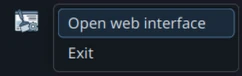

### Preferences

It is recommended that you start with the Preferences view, where you can seed the database with example scrapers and routines.\
Then, try executing some scrapers to see how they work.\
This will make it easier to learn how to use Web Scraper.

  
Show preview

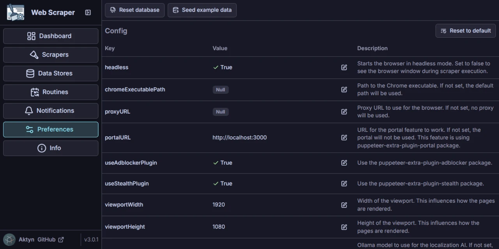

> It might be necessary to set **chromeExecutablePath** as a path to the browser executable.\
> Web Scraper will try to find the browser executable in the system and use it as default value for **chromeExecutablePath** but it might not work in some special cases (e.g. when browser is installed in a non-standard location).\
Same goes for **defaultUserDataDirectory** which is where browser stores its data like cookies, local storage, etc.

> **defaultUserDataDirectory** can be set per scraper allowing user to create scrapers that use different browser data directories and also scrapers that don't use any data directory at all for a clean run each time.

#### Mind the resolution

Web Scraper will render pages in **viewportWidth**\***viewportHeight** resolution.\
Keep in mind that, due to page responsiveness, some elements may be hidden at different resolutions.\
To avoid failing instructions due to elements not being visible, it is best practice to work with a similar resolution when building scrapers.

### Info

Check out the Info view for descriptions of the most commonly used terms throughout the project.

  
Show preview

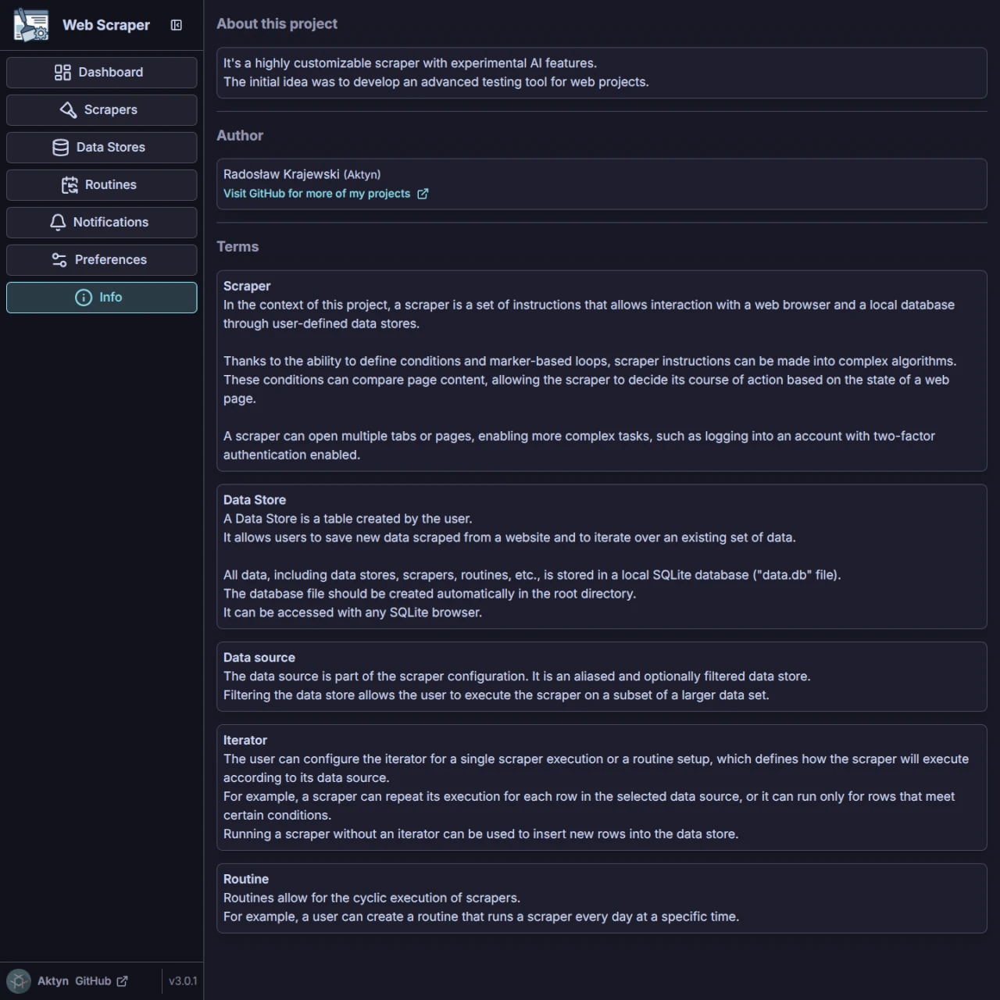

### Creating new scrapers

#### Basic information

Choose suitable name for the scraper and optionally add a description.\
You can also setup custom **User Data Directory** for the scraper, even your personal one (not recommended).

#### Preparing Data Stores

*This step is optional since some scrapers might not need reading or writing any persistent data.*\
Before creating a new scraper, prepare the data stores you intend to use.\
This process is fairly straightforward, as a data store is simply a table in a database.

  
Show example <b>Data Store</b>

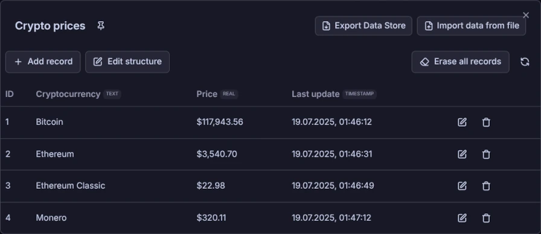

*Data from Data Stores can be exported to JSON or CSV files and imported back into the database.*

#### Attach Data Stores to the scraper

**Data Store** used by the scraper is referred to as the **Data Source**\
This distinction is important because the scraper can only use the part of the data store that is filtered by an SQL-like query.\
**Source alias** is used to reference the data source in the scraper instructions.

  
Show example <b>Data Source</b>

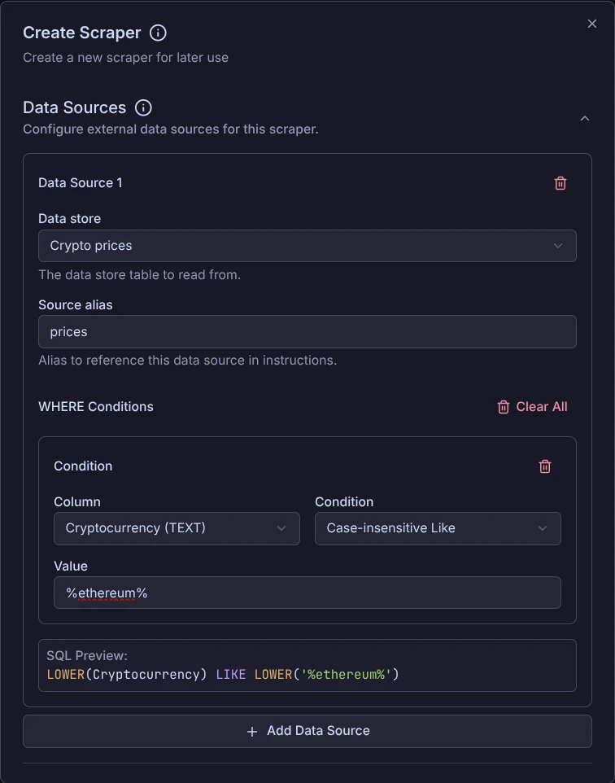\
In this example, the scraper only has access to rows where the cryptocurrency name includes "ethereum."

#### Setup instructions

This is the most crucial and most creative part of the scraper configuration.\
Seed example scrapers to see how instructions are structured.

Properly configuring the entire scraper flow is rarely done in one go.\
Rather, it is a trial-and-error process in which you constantly test and adjust the scraper flow until it works as expected.

It is recommended that you start with the **Navigate** action so that the scraper lands on the starting page.

  
Show preview of <b>Navigate</b> action

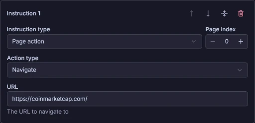

Many instructions performs an action on a specific element, such as clicking a button, filling in an input field, or reading the text content of an element.\
To point to the element, you configure selector in the instructions form.\
Most selector types are self-explanatory, but there is an advanced **CSS Query** selector.\
It requires a syntax that you can read about here: [CSS Selectors](https://developer.mozilla.org/en-US/docs/Web/CSS/CSS_selectors)\
You can copy selector of any element on the page by right-clicking on it in the Element Inspector (F12) and selecting **Copy** > **Copy selector**.

  
Show example in chrome dev tools

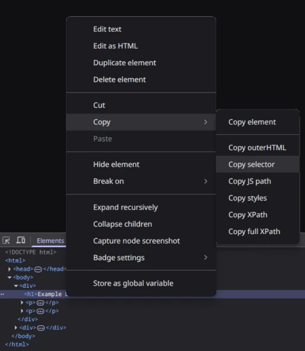

Scraper can use multiple pages (browser tabs) opened at the same time and share data between them.\
This could be useful for example during login with 2-factor authentication to retrieve an access code from email.

  
Show preview of example multiple tabs configuration

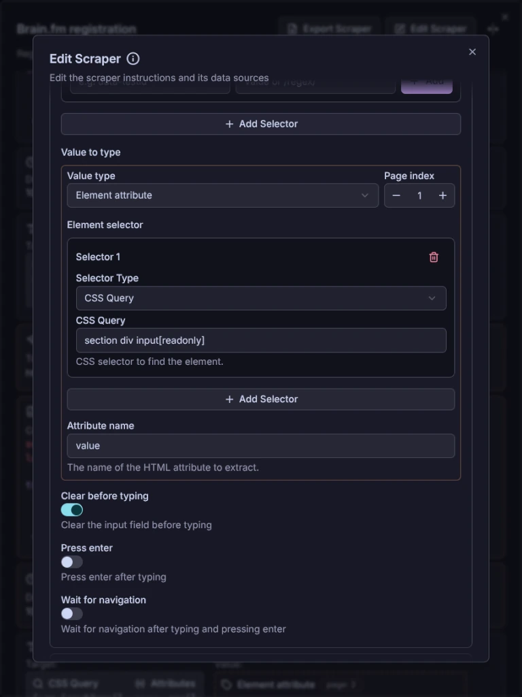\
In the above example, value scraped from second page *(index 1)* is used to fill the input field in the first page *(index 0)*.

You can set up a scraper to make decisions by defining a **condition** and specifying the instructions to be executed if the condition is met, as well as the instructions to be executed if it is not met.\
I can provide more types of conditions in the future or upon request.

  
Show example condition

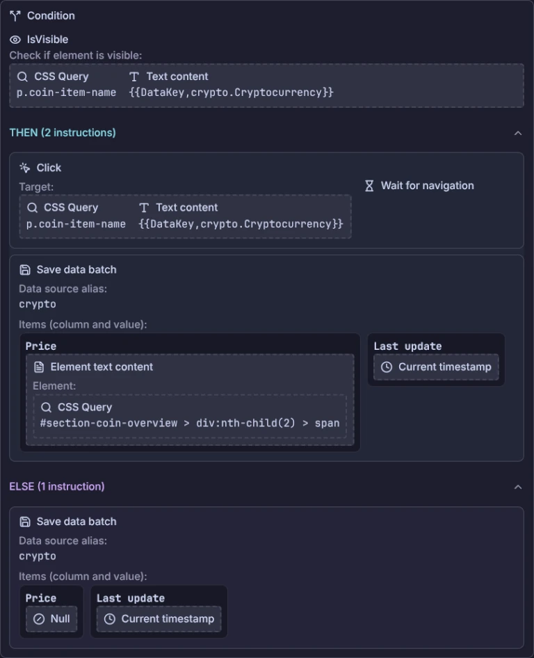

Combining conditions with **Marker** and **Jump** instructions allows to create a loop in the scraper flow.\
This feature needs to be improved due to risk of scraper getting stuck in an infinite loop.

#### Special strings

Input fields in the instructions form support special strings that can be used to dynamically set the value of the field.\
Special string has the following syntax: `{{type,arg1,arg2,...}}` where `type` is the type of the special string and `args` are the arguments for the special string.\
The following special strings are currently supported:

- **DataKey** - used to get value from a data store.\
It receives a single argument that is a data key in the format of **dataSourceName.columnName** where **dataSourceName** is source alias.\
Examples: `{{DataKey,prices.Cryptocurrency}}`

- **RandomString** - used to get a random string of a specified length.\
It receives an optional argument for the length of the string.\
If no argument is provided, the default length of 16 is used.\
Examples: `{{RandomString}}`, `{{RandomString,14}}`

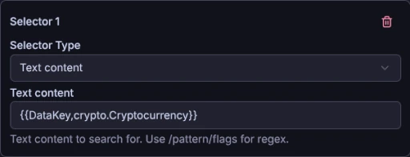

> [!NOTE]  
> This feature will be heavily expanded in the future.

#### Using custom JavaScript code

Scraper can execute/evaluate custom JavaScript in the page with **Page Action** -> **Evaluate** instruction.\
You can also write a function that will receive defined arguments.

#### Data related instructions

See [Configuring iterator](#configuring-iterator) section for more details on how data instructions work.

### Executing scrapers

#### Configuring iterator

Before executing a scraper, you may want to configure an iterator.\
Iterator is a way to iterate over a subset of data.

  
Show preview of iterator form

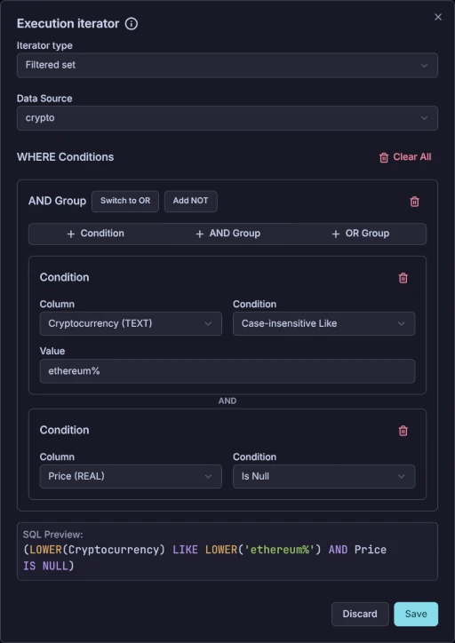\
In the above example, the scraper will execute for each row of **crypto** data source that matches the following condition: *the cryptocurrency name starts with "Ethereum" and the price is null (not yet set)*.

In each iteration, the scraper will work with a single row, meaning:

- The scraper will execute for each row of the data source that matches the iterator condition
- The scraper fetches data[^1] from the row it is currently iterating over
- **Save data** and **Save data batch** instructions will update currently iterated row
- **Delete data** instruction will delete currently iterated row

If no iterator is configured, then:

- The scraper will execute exactly once
- The data will be fetched[^1] from the last row of the data source
- **Save data** and **Save data batch** instructions will insert new rows into the data source
- **Delete data** instruction does not work without an iterator

In summary, iterating over a given data source is a way to update or remove existing rows from the data store.\
Executing the scraper without an iterator is an useful way to insert new rows into the data store.

> [!NOTE]  
> Keep in mind that you can only iterate over one data source at a time, whereas a scraper can work with multiple data sources simultaneously.\
> This means that you can iterate over one data source while inserting new rows into another.

#### Single execution

You can manually execute a scraper from its panel.\
The execution info will appear, allowing you to see in real time which instructions are being executed in the current iteration.

Each iteration is saved in the database and can be viewed in the execution history.\
This is useful for debugging and analyzing the scraper's behavior.

You can also preview each open page/tab through the portal, and the portal even allows you to interact with the page.

  
Show preview of running scraper

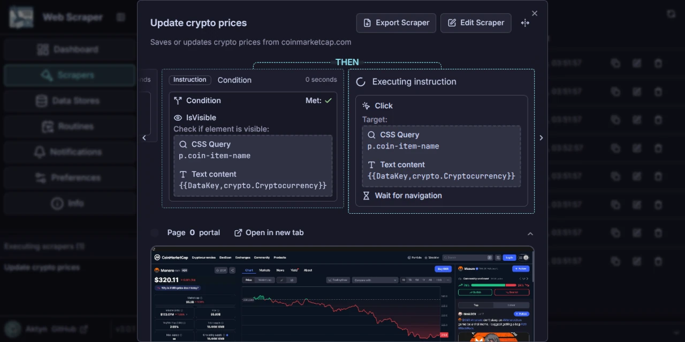

#### Routine execution

You can configure cyclic scraper execution by creating a routine.\
This is useful for tasks that need to be performed regularly, such as updating data stores with fresh data or awaiting[^2] some content to appear on the website.\
See below example for better understanding.

  
Show routine preview

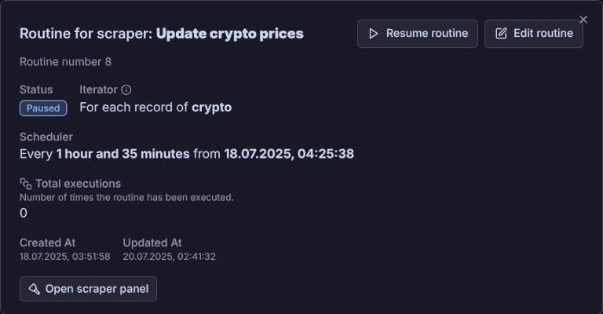

#### CLI execution

Web Scraper uses pino for logging.\
You can pipe it to pino-pretty to make it more readable.\
`./web-scraper | npx pino-pretty` or `./web-scraper | pino-pretty` if you have it installed globally.

See [CLI](#cli) section for more details.

## Development setup

It's pretty standard npm monorepo with workspaces.\
See scripts in the [package.json](./package.json) for more details.

## Future plans

- Scrapers marketplace where users can share and download ready to use scrapers
- Common behaviors like automatically accepting cookies, privacy policy, etc
- Variables allowing to use scraped data as input in following instructions\
Currently, to achieve this, users have to use some "buffer" Data Store for temporarily storing data
- More suitable LLM for web scraping and AI agent improvements
- More condition types
- More developed "special strings" feature

[^1]: ***fetching data*** refers to all the ways a scraper can read data from a data source, such as the **External data** type of **Value Selector** in the scraper instructions or the **DataKey** type of special string.
[^2]: Web Scraper can display system notifications and run custom commands.
