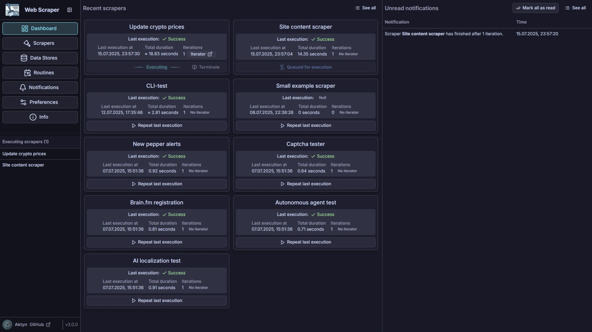

# Web Scraper

This is a highly customizable, Puppeteer-based scraper with experimental AI features.\
The initial idea was to develop an advanced testing tool for web projects.

## Requirements

- Chrome or Chromium browser is required.\
It might be necessary to provide path to the browser executable in the settings.
- Ollama is required for AI features. [About Ollama](https://ollama.ai/)\
User must also make sure that proper model is pulled and ready to use in Ollama.\
By default, the project uses [qwen2.5vl:32b](https://ollama.com/library/qwen2.5vl) model. It can be changed via Web Scraper preferences.

### System support

#### Development

The development mode should work on every system without any additional setup except `npm install` of course.

#### SEA

There is a SEA build possible. [About SEA](https://nodejs.org/api/single-executable-applications.html)\
For now, the SEA has only been build and tested on Linux.\
I'm happy to provide support and binaries for other systems upon request.\
To build the SEA, run `npm run build:sea` in the root directory.

## Features and use cases

### Regular web scraping

Properly configuring a working scraper can be difficult at first.
This project is designed to be highly customizable and flexible.\
This is a fairly obvious statement, but a scraper can interact with websites in various ways, such as typing, clicking, and scrolling.

Users can define conditions that allow the scraper to decide its course of action based on data from the page or external sources.\
In addition to conditions, the scraper can also return to previous instructions, forming a controlled loop in the scraper execution.\
Another form of repetition is possible: the scraper can iterate over a set of data. For example, it can iterate over every nth row of a table.

See [How it works](#how-it-works-with-screenshots-and-videos) section for more details and examples.

### Routines

By configuring routines, users can schedule scraper executions at specific times or intervals.\
For example, you can set up a routine that runs a scraper at noon every day. For the sake of this example, let's say the scraper updates cryptocurrency prices stored in a database. Since the database is just a local SQLite file, users can do whatever they want with the scraped data.

### CLI

The Command Line Interface (CLI) allows you to run scrapers directly from your terminal.\
Key features include executing scrapers by name from the database or running them from local JSON files.\
You can use an in-memory database for testing or any other use case that doesn't require external data.

Thanks to the CLI, this project can be used as an automated testing tool for any local or external website.

  
<b>Examples</b>

- Execute a scraper from the database by name:\
**`web-scraper execute-scraper --scraper "My Scraper" --silent`**\
Note *`--silent`* flag. It is used to avoid printing logs to the console. Only scraper output will be printed which allows to process it in bash scripts. There is a dedicated scraper instruction for such use case.

- Execute a scraper from a local JSON file with an iterator:\
**`web-scraper execute-scraper --scraper /path/to/scraper.json --iterator '{"type":"entire-set","dataSourceName":"some-data"}'`**

- Run a scraper using an in-memory database for a clean test run:\
**`web-scraper execute-scraper --scraper "My Scraper" --inMemoryDatabase`**

### AI

AI features are rather experimental and shouldn't be relied on yet.\
Right now there are two AI uses in the project:

- **Localization:**\
Users can set up a scraper to click on an element by describing it in natural language.\
This is useful for sites that often change their layout, causing predefined element queries to become obsolete.
- **Autonomous agent:**\
AI driven agent that can autonomously use the browser and interact with data sources to perform any task described by user.\
In theory it would be able to do anything a human can do but it gets easily lost during more complex/longer tasks and requires very detailed instructions.\
I'm still working on improving the agent's capabilities.

I'm planning to integrate more suitable LLM in the future: [Holo1](https://huggingface.co/Hcompany/Holo1-7B)

### Portal

By default, scrapers run in headless mode which means that the browser is not visible to the user. This should not be changed although there is an option to run the browser in non-headless mode.

User can spy on the scraper through a portal (a small iframe in the Web UI).\
Useful for testing new scrapers or debugging existing ones.\
It is also possible to interact with the page through the portal.

## How it works (with screenshots and videos)

TODO

  
<b>Dashboard</b>

## Setup and development

It's pretty standard npm monorepo with workspaces.\
See scripts in the [package.json](./package.json) for more details.
